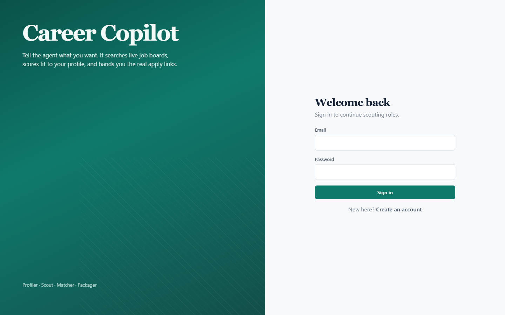
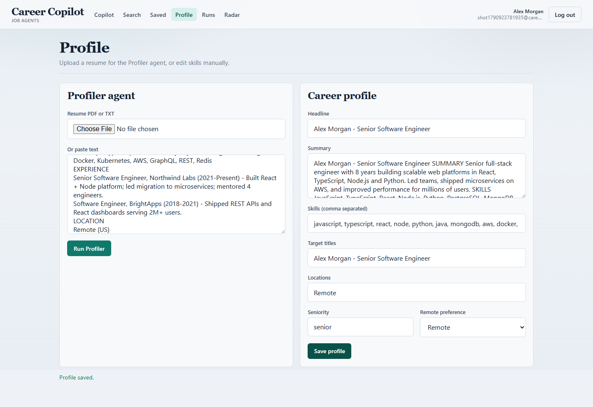
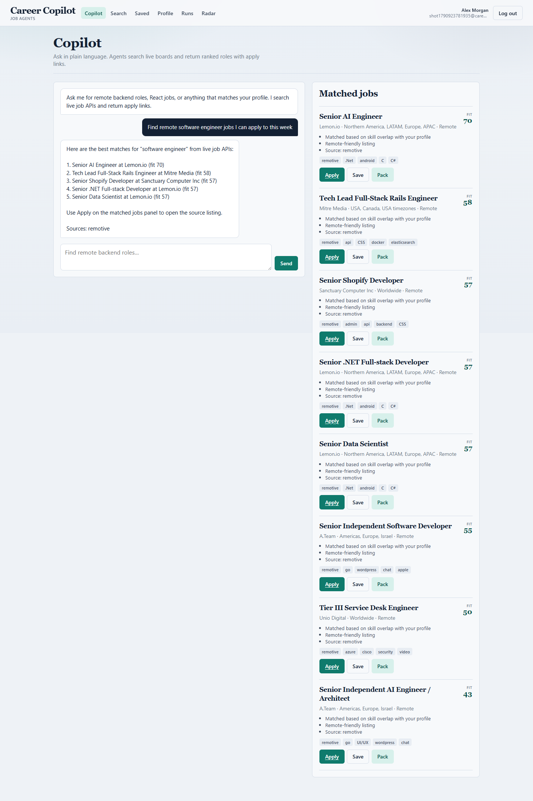
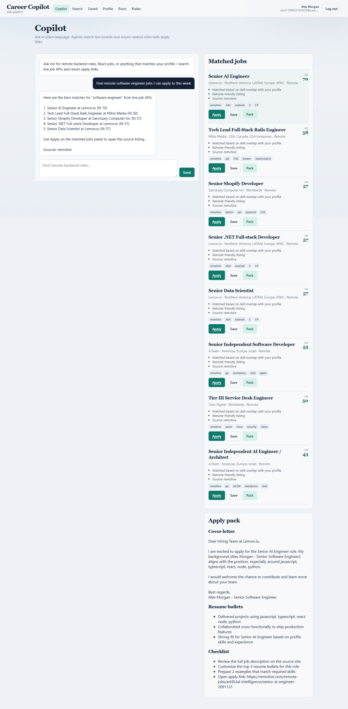
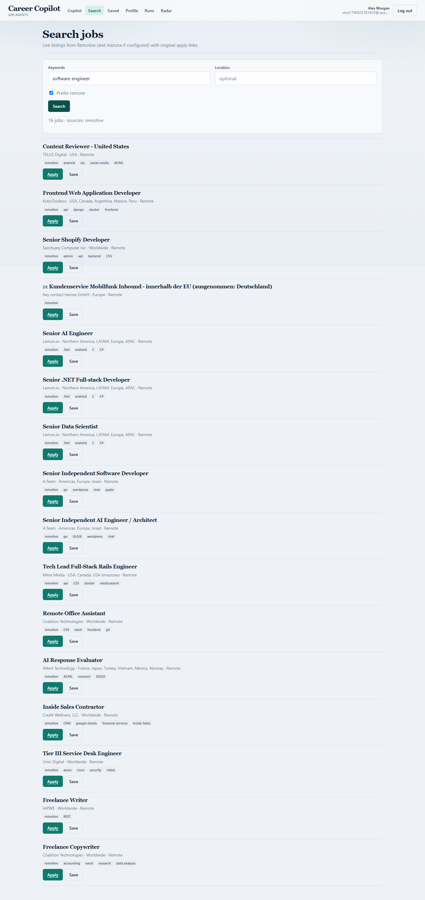
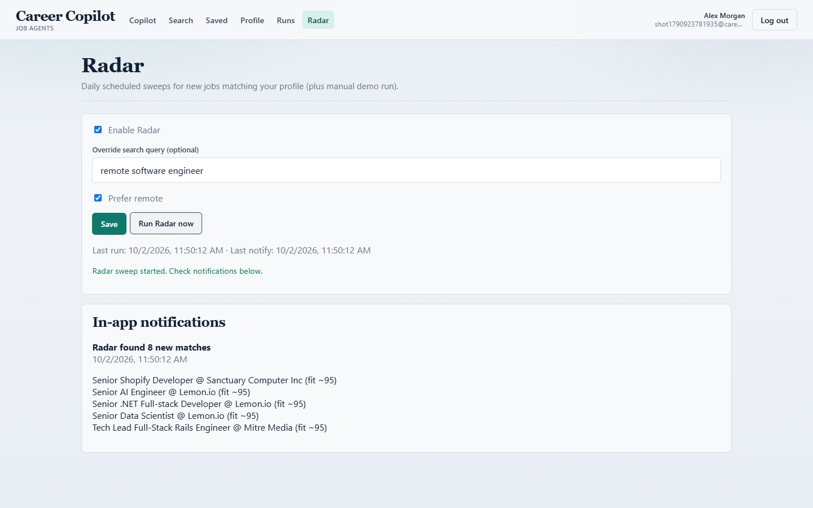

# Career Copilot

MERN microservices platform with AI agents that search live job APIs, score fit against your profile, and prepare apply packs — then send you to the **original apply URL** on the source site.

## Screenshots

| Login | Profiler agent |
| --- | --- |
|  |  |

| Copilot — ranked matches | Apply pack |
| --- | --- |
|  |  |

| Live job search | Radar + notifications |
| --- | --- |
|  |  |

## Architecture

- `apps/web` — React + Vite + TypeScript
- `services/gateway` — JWT auth, rate limits, reverse proxy
- `services/auth-service` — register / login / refresh
- `services/profile-service` — profile CRUD, resume Profiler, saved jobs
- `services/job-service` — Remotive (+ optional Adzuna), Redis cache
- `services/agent-service` — Planner → Scout → Matcher → Packager + Radar cron
- `services/notification-service` — in-app notifications (+ optional SMTP)
- `packages/shared` — shared Zod schemas / types

## Prerequisites

- Node.js 20+
- Docker (for MongoDB + Redis)

## Quick start

```bash
# 1. Infra (Mongo on 27017, Redis on 6399 to avoid local conflicts)
docker compose up -d

# 2. Env
copy .env.example .env
# Optional free LLM: set GROQ_API_KEY from https://console.groq.com
# Optional: ADZUNA_APP_ID / ADZUNA_APP_KEY

# 3. Install + build shared types
npm install
npm run build:shared

# 4. Run from repo root (separate terminals) or:
#    .\scripts\dev-all.ps1
npm run dev:auth
npm run dev:profile
npm run dev:job
npm run dev:agent
npm run dev:notification
npm run dev:gateway
npm run dev:web
```

Open http://localhost:5173 — API gateway http://localhost:4000

Demo account created during smoke test (if you kept the DB): `demo@careercopilot.test` / `password123`

## Free LLM note

Without `GROQ_API_KEY`, Profiler / Matcher / Packager use heuristic fallbacks so the app still works. With a free Groq key, agents use `llama-3.3-70b-versatile` via the OpenAI-compatible API.

Remotive job search needs **no API key**.

## Main flows

1. Register → Profile → upload resume or paste text (Profiler)
2. Copilot chat → agent run → ranked jobs with Apply links
3. Save job → Generate apply pack
4. Radar → enable + Run now → notifications
